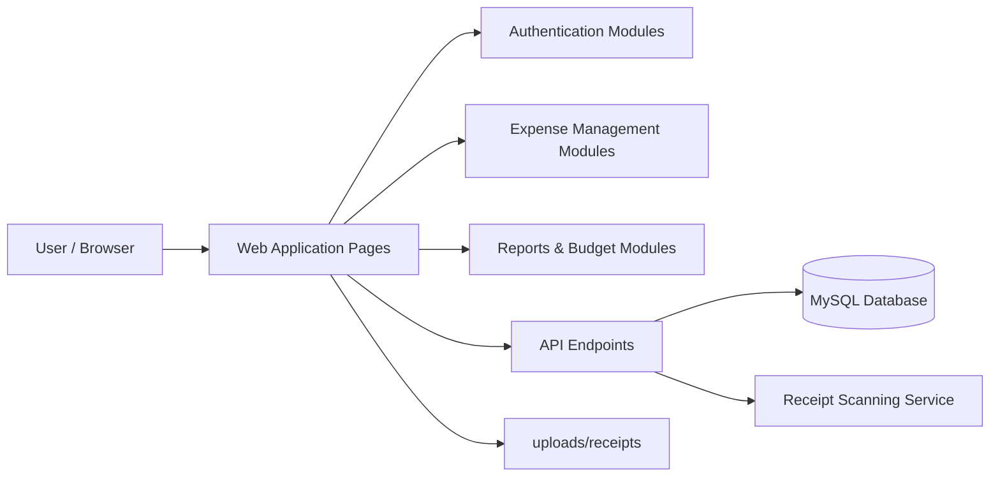
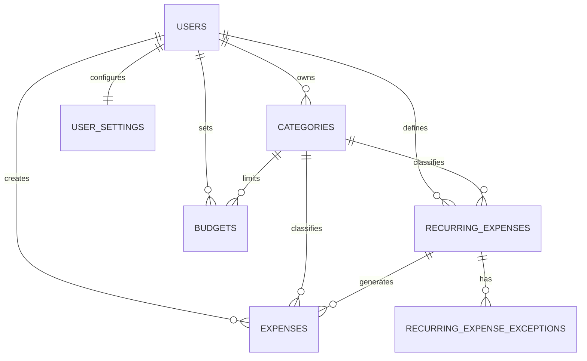

# Expense Tracker System Design

## 1. Overview
PennyPulse is a PHP-based expense tracking web application that allows users to register, authenticate, create and manage expenses, define recurring expenses, set budgets, and generate reports. The system is designed as a modular web application with a relational database backend and file-based storage for receipt uploads.

## 2. System Architecture
The application follows a simple three-tier architecture:

- Client Layer: the browser-based user interface rendered through PHP pages and shared HTML/CSS/JavaScript.
- Application Layer: PHP scripts and API endpoints that handle authentication, expense management, recurring transactions, budgets, reports, and settings.
- Data Layer: a MySQL database for structured data and a receipts directory for uploaded files.

### High-Level Component Diagram

### Design Characteristics
- Modular feature-based structure rather than a strict MVC framework.
- Session-based authentication for secure access to user-specific data.
- Relational storage for entities such as users, expenses, categories, budgets, and recurring schedules.
- File storage for receipts and supporting documents.
- Configuration-driven database access through a central PHP configuration file.

## 3. Functional Modules
The system is organized around the following functional areas:

- Authentication: login, registration, logout, password change, and account deletion.
- Expense Management: add, edit, view, and delete expenses.
- Recurring Expenses: create recurring patterns, process due transactions, and manage exceptions.
- Budgets and Settings: define budget limits per category and manage user preferences.
- Reporting and Export: view financial summaries and export data.
- File Handling: upload and store receipts for expense records.

## 4. Database Design
The database design uses a relational model to support one-to-many and many-to-one relationships between users, categories, expenses, recurring plans, budgets, and settings.

### 4.1 Conceptual Data Model
The conceptual model identifies the main business entities and their relationships:

- User: owns account information and all personal financial data.
- Category: groups expenses and budgets into logical spending areas.
- Expense: records an individual financial transaction.
- Recurring Expense: defines a repeating expense pattern.
- Recurring Expense Exception: stores exceptions to recurring schedules.
- Budget: defines a spending limit for a category within a month.
- User Settings: stores interface and notification preferences.

### 4.2 Logical Data Model
The logical model defines the main entities and attributes used by the application.

- Users: id, first_name, last_name, email, username, password, phone
- Categories: id, user_id, name
- Expenses: id, user_id, category_id, amount, description, date, merchant, payment_method, is_recurring, receipt_path, recurring_end_date, type, recurring_expense_id, is_override
- Recurring Expenses: id, user_id, category_id, amount, description, frequency, start_date, end_date, last_processed, next_due_date, is_active, merchant, payment_method, receipt_path
- Recurring Expense Exceptions: id, user_id, recurring_expense_id, exception_date, reason
- Budgets: id, user_id, category_id, month, budget_amount
- User Settings: user_id, theme, language, email_notifications, in_app_notifications

### 4.3 Entity Relationship Diagram

### 4.4 Physical Data Model
The physical model is implemented in MySQL using the following conventions:

- Primary keys use auto-incrementing integer identifiers.
- Foreign keys enforce referential integrity between users, categories, expenses, recurring expenses, budgets, and settings.
- Decimal values are used for monetary amounts to preserve precision.
- Date and timestamp fields track transaction dates and record updates.
- Unique constraints ensure a user cannot create duplicate category names for the same context.
- Cascading deletes are used to remove dependent records when a parent user is deleted.

### 4.5 Physical Table Notes
- The users table stores account credentials and profile details.
- The categories table supports both user-specific categories and shared default categories.
- The expenses table records the actual transaction history.
- The recurring_expenses table stores the schedule logic for repeat transactions.
- The budgets table captures spending thresholds by month and category.
- The user_settings table stores personalization preferences.

## 5. Data Flow Overview
A typical expense lifecycle works as follows:

1. A user logs in and accesses the dashboard.
2. The user enters expense details through the web interface.
3. The application validates the request and stores the record in the database.
4. If the expense is configured as recurring, the rule is stored in the recurring_expenses table and later processed into actual expense entries.
5. Reports and budgets are generated from the stored transaction data.

## 6. Summary
This system design provides a scalable and maintainable structure for an expense tracking application. Its modular PHP architecture, relational database design, and clear separation of user interface, business logic, and data storage make it suitable for future extension such as additional analytics, mobile support, or API-based integrations.

