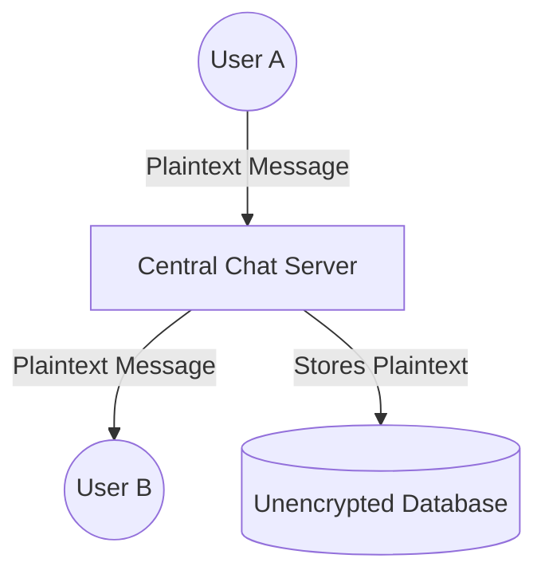
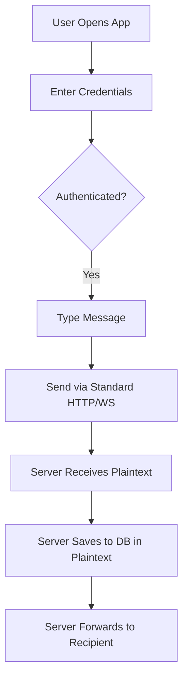
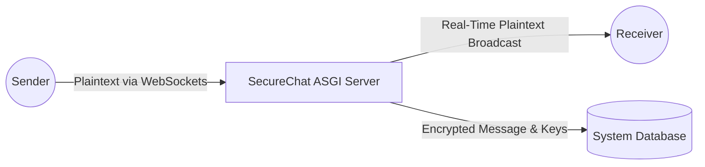
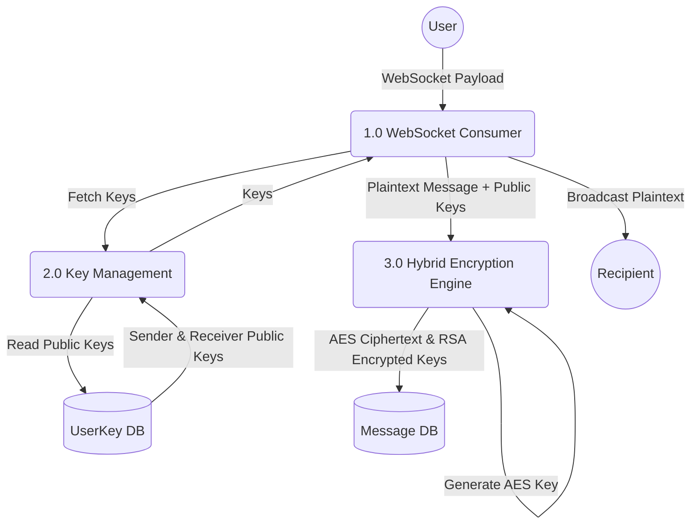
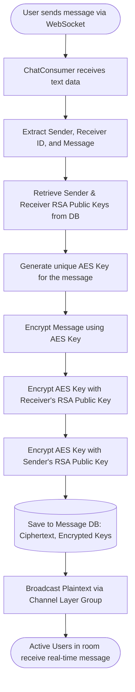
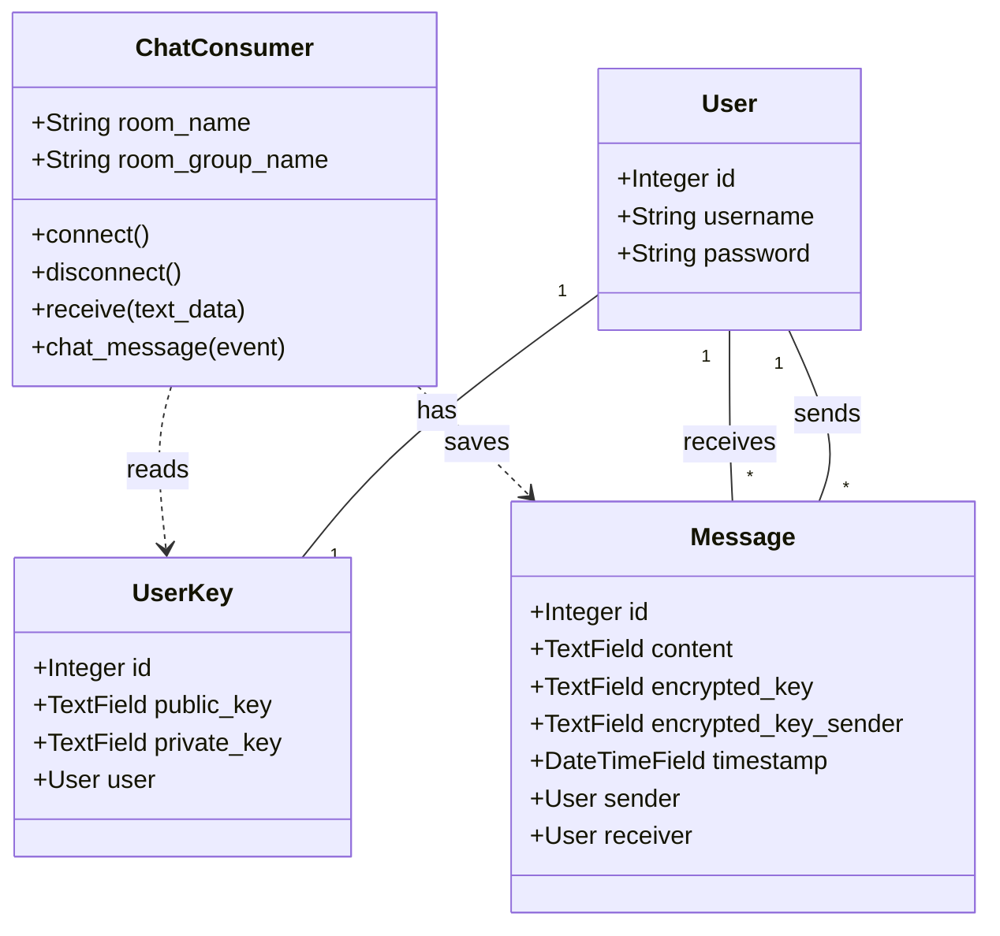
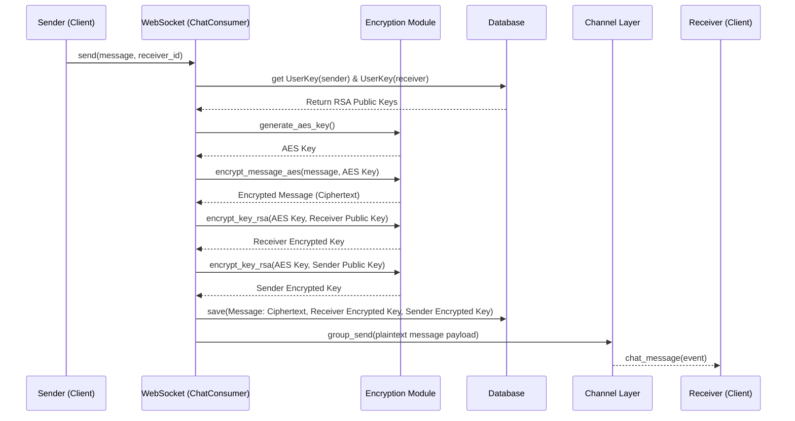

# CHAPTER 4: SYSTEM ANALYSIS AND REQUIREMENT MODELING

## 4.1 Introduction
This chapter provides an in-depth analysis of the current communication landscape, detailing how users interact with messaging systems and identifying the critical shortcomings that necessitate the development of the SecureChat application. Furthermore, it outlines the structured methodologies employed for fact-finding and data gathering, translating these findings into robust system requirements. The chapter concludes with comprehensive system models—including Use Cases, Data Flow Diagrams (DFDs), Flowcharts, and Unified Modeling Language (UML) diagrams—to blueprint both the existing workflows and the architectural design of the implemented system.

## 4.2 Fact-Finding and Data Gathering Methods
To ensure that the SecureChat application accurately addresses the real-world security and usability needs of its target audience, a systematic approach to data gathering was undertaken. The following methods were utilized:

### 4.2.1 Interviews
Structured and semi-structured interviews were conducted with potential end-users, cybersecurity professionals, and network administrators.
*   **End-Users:** Focused on their current messaging habits, awareness of data privacy, and expectations regarding usability versus security. Many expressed a desire for a system that is as intuitive as standard SMS but with guaranteed storage privacy.
*   **Cybersecurity Professionals:** Provided insights into securing data at rest using hybrid cryptographic models (e.g., combining AES and RSA). 

### 4.2.2 Questionnaires and Surveys
A digital survey was distributed to a sample group of 150 individuals across various demographics to gather quantitative data on:
*   The frequency of sharing sensitive information over chat.
*   The level of trust in mainstream communication platforms.
*   **Findings:** Over 70% of respondents indicated discomfort with sharing sensitive data on platforms where message storage is easily accessible in plaintext by administrators.

### 4.2.3 Document and Literature Review
Existing documentation, privacy policies, and technical whitepapers of popular messaging apps were reviewed to identify metadata storage practices and benchmark best practices in deploying WebSocket-based real-time communication on Django platforms.

### 4.2.4 Direct Observation
Observations of users interacting with enterprise and consumer tools revealed that complex security setups deter use. Therefore, SecureChat must handle encryption operations seamlessly in the background (server-side) to ensure a frictionless user experience.

---

## 4.3 Requirement Definitions and Modeling of the Current System

### 4.3.1 Description of the Current System
Standard, unencrypted web chat applications lack robust cryptographic protections. In these systems, a server processes and stores messages in a database in plaintext, making them vulnerable to database breaches or unauthorized administrative access.

### 4.3.2 Modeling the Current System
Below are visual representations of how legacy/standard chat systems operate, exposing their vulnerabilities.

#### Current System - Context Data Flow Diagram (Level 0 DFD)


#### Current System - Flowchart


---

## 4.4 Requirement Definitions and Specifications of the Implemented System

SecureChat is designed to protect message storage by utilizing server-side hybrid encryption. WebSockets are used for real-time delivery, and payloads are encrypted before persistence to the database.

### 4.4.1 Functional Requirements
1.  **User Authentication:** Users register and authenticate securely.
2.  **Cryptographic Key Management:** The system generates an RSA public/private key pair (`UserKey`) for users, managed securely by the server.
3.  **Real-Time Messaging:** The system utilizes WebSockets via Django Channels for live, bidirectional message broadcasting within chat rooms.
4.  **Server-Side Data-at-Rest Encryption:**
    *   The backend must generate a unique AES symmetric key for every message.
    *   The message content must be encrypted using this AES key.
    *   The AES key must be independently encrypted using both the recipient's and sender's RSA public keys.
    *   Ciphertext and the encrypted AES keys are stored in the database, securing messages at rest.
5.  **Chat Rooms:** Direct 1-on-1 messaging logic with unique room grouping based on User IDs.

### 4.4.2 Software Specifications
*   **Backend Framework:** Django (Python)
*   **Asynchronous Server:** ASGI with Django Channels
*   **Real-time Protocol:** WebSockets (Redis Channel Layer)
*   **Database:** SQLite / PostgreSQL
*   **Cryptographic Libraries:** Python `cryptography` package (AES & RSA)

---

## 4.5 System Modeling of the Implemented System

To provide a clear architectural blueprint, the SecureChat system is modeled using standard UML and DFD paradigms.

### 4.5.1 Use Case Diagram
Illustrates the interactions between the primary actor (the User) and the system's core functionalities.

```mermaid
usecaseDiagram
    actor User as "Registered User"

    package SecureChat {
        usecase UC1 as "Register Account"
        usecase UC2 as "Login"
        usecase UC3 as "Initiate Chat Session"
        usecase UC4 as "Send Message"
        usecase UC5 as "Receive Real-Time Message"
        usecase UC6 as "Server: Encrypt Message for Storage"
    }

    User --> UC1
    User --> UC2
    User --> UC3
    User --> UC4
    User --> UC5
    UC4 ..> UC6 : <<triggers>>
```

### 4.5.2 Data Flow Diagrams (DFD)

#### Level 0 DFD (Context Diagram)
Shows the SecureChat system handling communication and securing data at rest.



#### Level 1 DFD
Breaks down the system into Authentication, Key Retrieval, and Message Processing.



### 4.5.3 Flowcharts and Activity Diagrams

#### Server-Side Message Processing Flowchart
This flowchart details the step-by-step logic inside the Django Channel `ChatConsumer` upon receiving a message.



### 4.5.4 UML Class Diagram
Maps the object-oriented structure of the Django backend, focusing on models and WebSocket consumers.



### 4.5.5 UML Sequence Diagram
Visualizes the asynchronous WebSocket messaging and server-side encryption logic flow in chronological order.



## 4.6 Conclusion
This chapter has established the architectural framework and system modeling for the SecureChat application. Through detailed Use Case scenarios, DFDs, Flowcharts, and UML diagrams, it is evident that the system implements a robust server-side hybrid encryption model (AES + RSA). This approach ensures that while active chat sessions occur efficiently in real-time via WebSockets, all messages persisted in the database are fully encrypted, securing data at rest from unauthorized database exposure.
